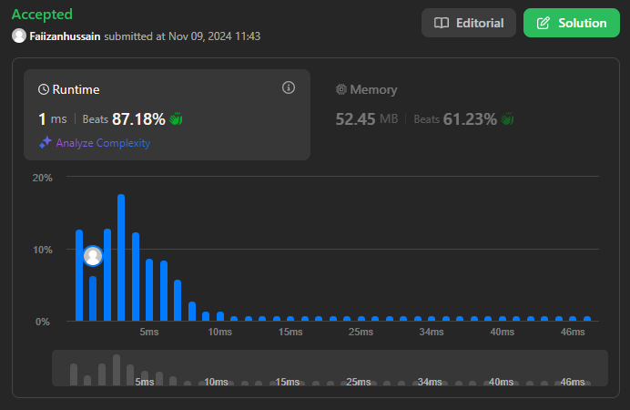
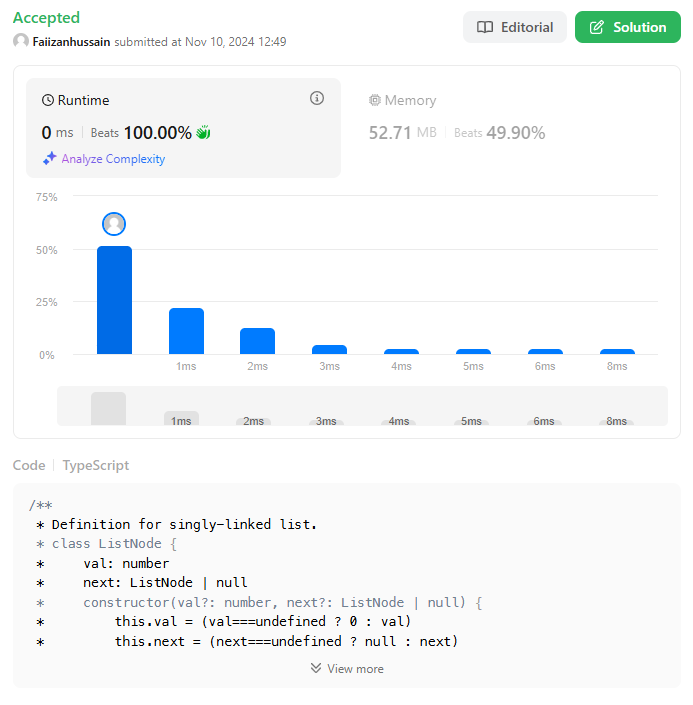
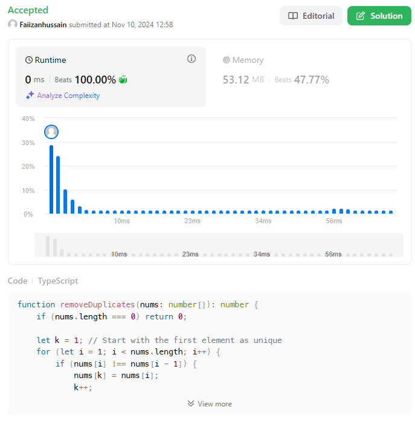
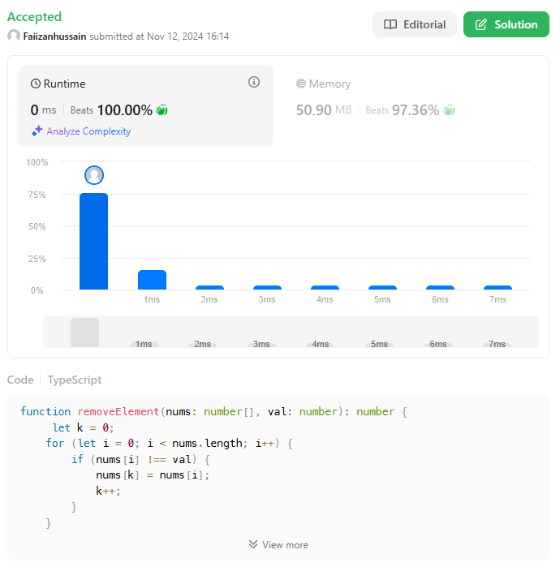
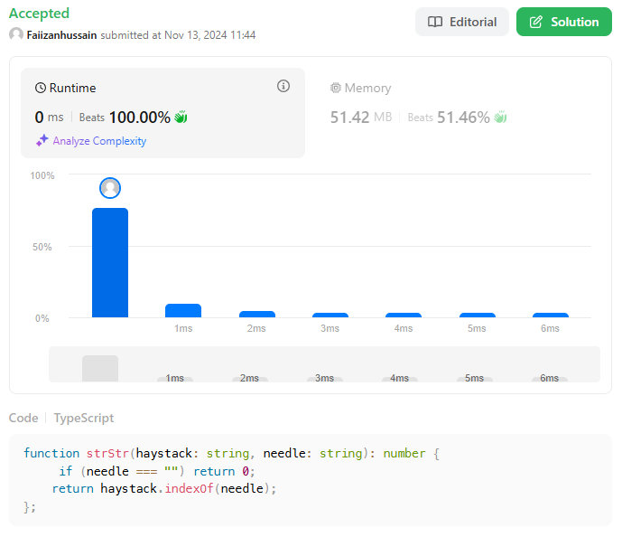
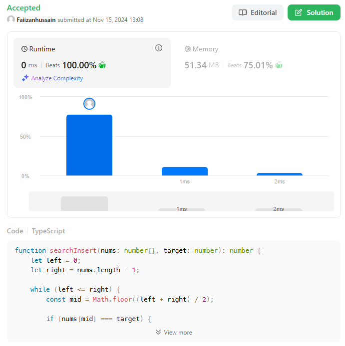
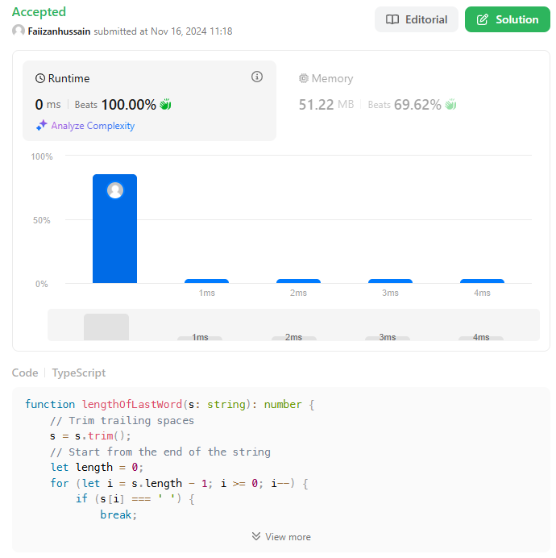
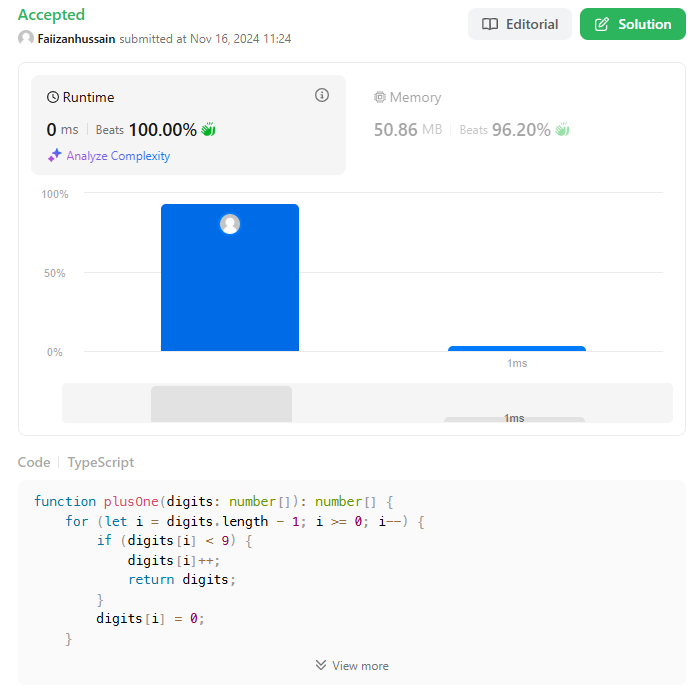
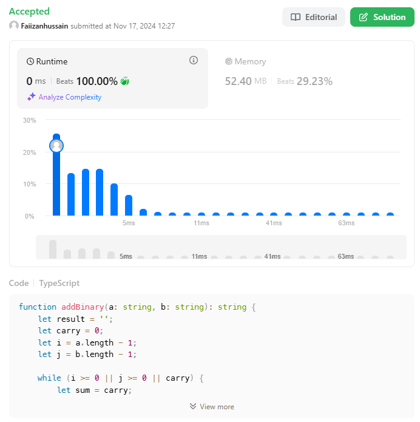
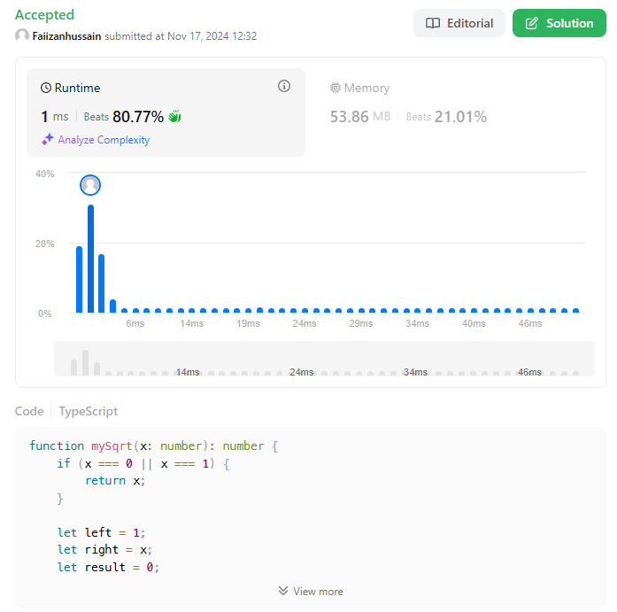

## Index
- [Results for Valid Parenthesis](#results-for-valid-parenthesis)
- [Results for Merge Sorted Lists](#results-for-merge-sorted-lists)
- [Results for Remove Duplicated from Sorted Array](#results-for-remove-duplicated-from-sorted-array)
- [Results for Removing Elements](#results-for-removing-elements)
- [Index of the First Occurrence in a String](#index-of-the-first-occurrence-in-a-string)
- [Search Insert Position](#search-insert-position)
- [Length of Last Word](#length-of-last-word)
- [Plus One](#plus-one)
- [Add Binary](#add-binary)
- [Sqrt(x)](#sqrtx)

## Results for Valid Parenthesis

## Results for Merge Sorted Lists

## Results for Remove Duplicated from Sorted Array

## Results for Removing Elements
Given an integer array nums and an integer val, remove all occurrences of val in nums in-place. The order of the elements may be changed. Then return the number of elements in nums which are not equal to val.

Consider the number of elements in nums which are not equal to val be k, to get accepted, you need to do the following things:

Change the array nums such that the first k elements of nums contain the elements which are not equal to val. The remaining elements of nums are not important as well as the size of nums.
Return k.

## Index of the First Occurrence in a String
Given two strings needle and haystack, return the index of the first occurrence of needle in haystack, or -1 if needle is not part of haystack.

## Search Insert Position
Given a sorted array of distinct integers and a target value, return the index if the target is found. If not, return the index where it would be if it were inserted in order.

You must write an algorithm with O(log n) runtime complexity. 

## Length of Last Word
Given a string `s` consisting of words and spaces, `return` the length of the last word in the `string`.

A word is a maximal `substring` consisting of non-space characters only.

## Plus One

You are given a large integer represented as an integer array digits, where each digits[i] is the ith digit of the integer. The digits are ordered from most significant to least significant in left-to-right order. The large integer does not contain any leading 0's.

Increment the large integer by one and return the resulting array of digits.

## Add Binary

Given two binary strings `a` and `b`, return their sum as a `binary` string.

## Sqrt(x)

Given a non-negative integer `x`, return the square root of `x` rounded down to the nearest integer. The returned integer should be non-negative as well.

You must not use any built-in exponent function or operator.
    - For example, do not use `pow(x, 0.5)` in c++ or `x ** 0.5` in python.

